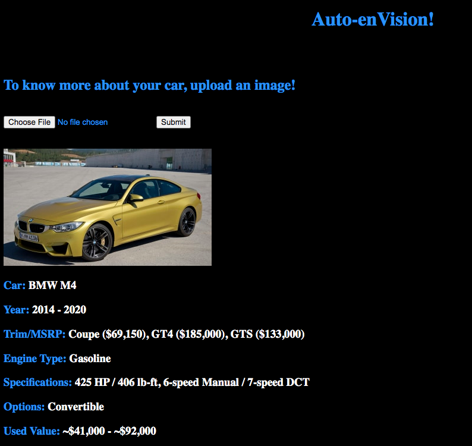

# Welcome to Auto-enVision!

Current Web Application : https://auto-envision.herokuapp.com/

## Motivations
For a car buyer, the current research/car shopping process is in 1 of 3 ways. First way, the buyer knows the make/model he/she is looking for. Second way, the buyer isn't exactly sure, so he/she uses car style criteria. Lastly, when the previous two steps weren't good enough, he/she will uses advance search for more criteria to filter. 

Screenshot of a search bar from AutoTrader highlighted the 3 methods:

The results after those methods returns a long list of car options. If the search for a used car, the result will be much longer where it includes different generations of the same model name. Each of 3 method requires buyer to have some knowledge of what he/she wants.

This rises my first question:

What if a car buyer doesn't know what he/she wants but has a image of the car he/she likes without any knowledge about it, can there be a simple way for him/her to learn about the car in the image without going through searching/filtering process?

For a car seller, the current process required the seller to research through Kelly Blue Book, Craiglist, or other 3rd party resell sites to get a approximated worth of his/her car. 

This rises my second question:

Can there be a simple step to condense multiple steps into 1 step for the car owner to get a worth range for his/her car?

According to Autotrader, mobile device usage for car research has surpass 53% and has been on increasing trend since 2015.

This rises my third question:

Are there ways to ultiize mobile device to allow car buyers and car sellers to do car reserach whenever/whereever they spotted a car they like? 

The answer to these questions, Auto-enVision.

## What is Auto-enVision?
Auto-enVision is a car model recognition tool. After a car image is uploaded, it returns relevent information about the car, such as make/make, year, trim/MSRP, specifications and used value. 

If you are a car buyer, this will help filter information to the generation model in the image. This enables you to do car ressearch whenever or whenever you see a car. For example, if you are on a street and spotted a car that appeals to you, you can use Auto-enVision. 
If you are a car seller, you can upload an image of your car to Auto-enVision to quickly get the current worth range in the used market.   

Pros: 

- You don't need to know anything about cars.

- 1 step process of image upload.

- All the relevent information in one page.

Cons:

- It requires an image. Depending on situation, it may not be the most ideal option.

## Creating/Building Auto-enVision

I wanted to included my own car, Jeep Renegade and 3 other models with similar shape to allow the algoithm to differentiate minor differences. Jaguar F-Type, BMW i8 and BMW M4 were the first 3 models came to mind. Thus, I decided to start with 4 models to build Auto-enVision.

Jeep Renegade:

Jaguar F-Type:

BMW i8: 

BMW M4:

### Data Collection

Used GettyImages, Bing Images, Google Images, ShuttleStock and Craigslist to gather and scrape total of 500 raw iamges for each model. 

I gathered and set aside 35 images as additional test set for Auto-enVision.

### Data Cleaning

With all the raw images of each model, I filter down to 200 images with only exterior views.

Examples of exterior views and angles:

### Data Preprocessing

After cleaning the images, each image went through series of image augmentation.

Image augmentation:

- Resize to 256 x 256.

- Croped out edges. Allow closer view and features of each image.

- Mirror, blur, mirror and blur. Allow a different view and clarity for each car model.

- Brighten, darken, increased and decreased color contrast. Since car has different colors, this creates different exposures and color variations for each image.

After all image augmentations, each model now has a total of 2400 images. 

### Data Modeling with Neural Network of Tensorflow Keras.

For the dataset of 9600 images, it was split into 3 sets for training, validation and test.

*Each activation layer uses Rectified Linear Units (ReLU).*

*Output layer uses softmax, for mulitclass-classification.*

#### Neural Network Model From Scratch

I started with broad Convolution Neural Network setup of:

Layers|
|---|
Conv2D: 32 filters of 3 x 3 matrix|
MaxPool: 2 x 2 matrix|
Dropout: 0.25|
Conv2D: 32 filters of 3 x 3 matrix|
MaxPool: 2 x 2 matrix|
Dropout: 0.25|
Conv2D: 32 filters of 3 x 3 matrix|
MaxPool: 2 x 2 matrix|
Dropout: 0.25|
Conv2D: 32 filters of 3 x 3 matrix|
MaxPool: 2 x 2 matrix|
Dropout: 0.25|
Flatten|
Dense: 256 Nodes|
Dropout: 0.5|
Dense_ouput: 4 Nodes|

It achieved validation and test accuracy of about **70%**.

After more iterations and tunning, the best setup was:

It started with a layer with 2 convolutional layers with wide size of 7 by 7 matrix, where it acted as a big lense to capture general features of the images. As it moves through each layer, the filter size decreases with more total filters to capture features in greater details. As the result, it achieved validation and test accuracty of about **95%**.

Although the accuracy was high, but when it was used on the 35 images test set, it was only able to correctly classify 25 images, or about **72%**. This showed weakness in the model where it couldn't effectively generalize images beyond the dataset; therefore, the model was overfitting. 
 
To reduce overfitting without adding more images, I decided to use Keras's pretrained model VGG16.

#### Neural Network Model with Keras VGG 16

Since VGG16 pretrained model has been trained with many images previously, I applied transfer learning for the model to trained with my dataset. I froze all layers of VGG16 up to last set of convolutional neural network to let it be trainable with my dataset. Then, it was flatten, went into dense layers with 256 nodes and then into output layer for classification.

VGG16 setup:

With its pretrained weights, it was about to achieved a validation and test accuracy of **98%**.

When it was used on the 35 images test set, it was able to correctly classify 32 images, or about **91%**. This model was able to significantly reduce overfitting from the previous model. 

### Misclassifed Example

This is an example of missclassification.

Both models on the left were the same model with different trim levels, Jaguar F-Type. It was able to correctly classify the model on the top but misclassified the bottom as a BMW M4. Some potential causes were the background and the very similar color of the wheels.

### Flask and HTML

Since the model with VGG16 achieved higher accuracy than my custom model, I used it into Flask with HTML to deploy into a web application via Heroku for everyone to test.

Example of current web application:

For each image, it will display some important information. 

### Conclusion/Improvments

The model is capable of recognizing car model through imagery with high accuracy. With this application, it will condense mulitple steps of car reserach for a car buyer and car seller into 1 simple step. Thus, it will reduce stress for car buyers and sellers. 

At this point, Auto-enVision is still in primilary stage. In order to improve effectivess and become a better model overall, it need:

- Add more images to increase accuracy to as close to 100% as possible.

- Add more car models and interior images.

- Add links of car listings.

- Breakdown the information in greater details, such as value range for vary conditions. 

